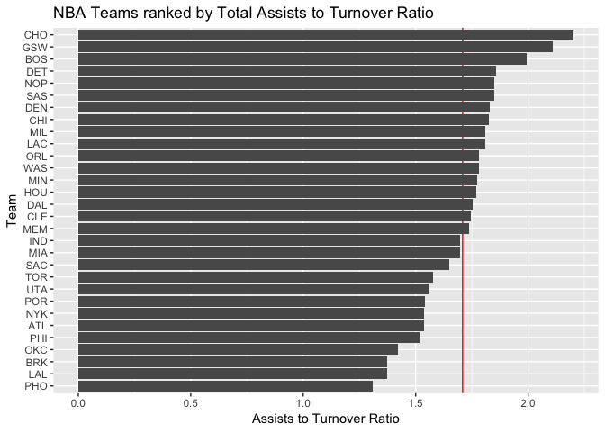

workout01-leonard-yang
================

``` r
library(readr) #importing data
library(dplyr) #data wrangling
```

    ## 
    ## Attaching package: 'dplyr'

    ## The following objects are masked from 'package:stats':
    ## 
    ##     filter, lag

    ## The following objects are masked from 'package:base':
    ## 
    ##     intersect, setdiff, setequal, union

``` r
library(ggplot2) #graphics)
```

``` r
nba = read_csv('/Users/leoyang19/desktop/hw-stat133/workout1/data/nba2018.csv')
```

    ## Parsed with column specification:
    ## cols(
    ##   .default = col_integer(),
    ##   player = col_character(),
    ##   number = col_character(),
    ##   team = col_character(),
    ##   position = col_character(),
    ##   height = col_character(),
    ##   birth_date = col_character(),
    ##   country = col_character(),
    ##   experience = col_character(),
    ##   college = col_character(),
    ##   salary = col_double(),
    ##   field_goals_perc = col_double(),
    ##   points3_perc = col_double(),
    ##   points2_perc = col_double(),
    ##   effective_field_goal_perc = col_double(),
    ##   points1_perc = col_double()
    ## )

    ## See spec(...) for full column specifications.

``` r
nba$experience[nba$experience == "R"]<- 0
nba$experience=as.integer(nba$experience)
nba$salary <- nba$salary/1000000

nba$position <- nba$position <- factor(
  nba$position, labels = c("center", "power_fwd", "point_guard", "small_fwd", "shoot_guard"))

nba = mutate(nba, missed_ft = nba$points1_atts - nba$points1, 
                   missed_fg = nba$field_goals_atts - nba$field_goals, 
                   rebounds = nba$off_rebounds + nba$def_rebounds)

nba = mutate(nba, efficiency = ((nba$points + rebounds + nba$assists + nba$steals + nba$blocks
                                 - missed_fg - missed_ft - nba$turnovers) / nba$games))
```

``` r
teams=data.frame(summarise(group_by(nba,team), 
                           experience=sum(experience), 
                           salary= round(sum(salary),2),
                           points3=sum(points3),
                           points2=sum(points2),
                           points1=sum(points1),
                           points=sum(points),
                           off_rebounds=sum(off_rebounds),
                           def_rebounds=sum(def_rebounds),
                           assists=sum(assists),
                           steals=sum(steals),
                           blocks=sum(blocks),
                           turnovers=sum(turnovers),
                           fouls=sum(fouls),
                           efficiency=sum(efficiency)
))
```

5) Ranking of Teams
===================

``` r
team_desc_salary= arrange(teams, desc(salary))
team_desc_salary
```

    ##    team experience salary points3 points2 points1 points off_rebounds
    ## 1   CLE        145 127.25    1030    2148    1384   8770          735
    ## 2   LAC        124 114.78     841    2401    1586   8911          738
    ## 3   MEM         90 108.95     757    2176    1489   8112          880
    ## 4   TOR         57 108.46     626    2359    1570   8166          847
    ## 5   SAS         99 105.40     753    2469    1440   8637          821
    ## 6   MIL         83 104.65     720    2462    1413   8497          723
    ## 7   ORL         62 104.11     618    2178    1232   7442          707
    ## 8   DET         55 103.07     631    2638    1140   8309          908
    ## 9   POR         43 102.49     847    2148    1386   8223          706
    ## 10  WAS         57 100.79     718    2526    1368   8574          806
    ## 11  GSW        113 100.24     982    2545    1455   9491          770
    ## 12  NYK         59  97.11     636    2445    1262   8060          962
    ## 13  NOP         78  94.04     519    1956    1128   6597          580
    ## 14  ATL        100  93.41     660    2337    1453   8107          832
    ## 15  DAL         65  92.83     712    1754    1007   6651          521
    ## 16  IND         95  92.62     709    2512    1467   8618          742
    ## 17  CHI         59  92.50     565    2162    1330   7349          865
    ## 18  BOS         63  91.92     985    2183    1536   8857          744
    ## 19  CHO         63  88.50     808    2089    1497   8099          621
    ## 20  SAC         77  88.28     562    1838     998   6360          525
    ## 21  HOU         70  87.39    1140    2011    1623   9065          857
    ## 22  OKC         55  86.98     611    2380    1511   8104          936
    ## 23  LAL         65  85.13     582    2069    1021   6905          789
    ## 24  UTA         71  80.32     791    2242    1401   8258          771
    ## 25  DEN         83  79.03     868    2351    1477   8783          872
    ## 26  BRK         70  76.22     777    2040    1444   7855          689
    ## 27  PHO         73  73.28     569    2554    1615   8430          882
    ## 28  MIA         63  72.94     799    2349    1217   8312          856
    ## 29  MIN         48  59.88     599    2607    1580   8591          932
    ## 30  PHI         39  56.29     718    1960    1225   7299          690
    ##    def_rebounds assists steals blocks turnovers fouls efficiency
    ## 1          2673    1779    483    304      1020  1356   182.0806
    ## 2          2790    1848    612    347      1022  1626   147.0737
    ## 3          2582    1725    629    335       993  1798   147.5533
    ## 4          2535    1469    620    379       932  1609   158.7556
    ## 5          2777    1954    655    484      1057  1498   149.7043
    ## 6          2589    1984    666    436      1096  1660   161.2450
    ## 7          2452    1760    546    305       987  1445   133.1438
    ## 8          2838    1732    574    310       932  1467   136.4089
    ## 9          2428    1508    522    342       978  1581   141.7957
    ## 10         2564    1893    655    325      1062  1643   147.8051
    ## 11         2869    2486    782    554      1179  1581   175.3384
    ## 12         2592    1499    526    451       975  1584   143.9152
    ## 13         2248    1531    502    380       828  1168   175.1662
    ## 14         2676    1846    645    381      1201  1432   147.2123
    ## 15         2063    1183    507    257       674  1229   144.6322
    ## 16         2702    1844    669    409      1087  1597   148.7141
    ## 17         2419    1746    605    339       956  1275   139.0978
    ## 18         2698    2069    617    340      1037  1686   148.2395
    ## 19         2615    1806    543    316       820  1177   141.5019
    ## 20         1876    1402    506    232       850  1303   155.8247
    ## 21         2608    1969    617    331      1113  1473   165.2848
    ## 22         2628    1610    595    395      1133  1561   146.9182
    ## 23         2213    1334    510    267       972  1444   131.4561
    ## 24         2774    1651    550    410      1060  1545   145.8056
    ## 25         2660    2015    543    286      1102  1475   172.2445
    ## 26         2697    1664    568    382      1212  1620   167.0333
    ## 27         2464    1531    588    385      1171  1887   149.2347
    ## 28         2648    1728    579    464      1019  1647   152.1863
    ## 29         2516    1924    641    368      1085  1620   140.7781
    ## 30         2354    1816    613    375      1197  1573   172.9546

``` r
ggplot(team_desc_salary, aes(x=reorder(team, salary), y=salary)) + 
  geom_hline(yintercept = mean(team_desc_salary$salary), color = "red") + 
  geom_bar(stat='identity') + labs(x='Team', y='Salary (in Millions)',
                                   title= 'NBA Teams ranked by Total Salary')+
  coord_flip()
```


``` r
ggplot(team_desc_salary, aes(x=reorder(team, points), y=points)) +
  geom_hline(yintercept = mean(team_desc_salary$points), color = "red") + 
  geom_bar(stat='identity') + labs(x='Team', y='Points',
                                   title= 'NBA Teams ranked by Total Points')+
  coord_flip()
```


``` r
ggplot(team_desc_salary, aes(x=reorder(team, efficiency), y=efficiency)) +
  geom_hline(yintercept = mean(team_desc_salary$efficiency), color = "red")+
  geom_bar(stat='identity') + labs(x='Team', y='Efficiency',
                                   title= 'NBA Teams ranked by Total Efficiency')+
  coord_flip()
```

 \#Own Index Barchart

``` r
teams_assist_to=mutate(teams, assist_to = (teams$assists/teams$turnovers))
teams_assist_to
```

    ##    team experience salary points3 points2 points1 points off_rebounds
    ## 1   ATL        100  93.41     660    2337    1453   8107          832
    ## 2   BOS         63  91.92     985    2183    1536   8857          744
    ## 3   BRK         70  76.22     777    2040    1444   7855          689
    ## 4   CHI         59  92.50     565    2162    1330   7349          865
    ## 5   CHO         63  88.50     808    2089    1497   8099          621
    ## 6   CLE        145 127.25    1030    2148    1384   8770          735
    ## 7   DAL         65  92.83     712    1754    1007   6651          521
    ## 8   DEN         83  79.03     868    2351    1477   8783          872
    ## 9   DET         55 103.07     631    2638    1140   8309          908
    ## 10  GSW        113 100.24     982    2545    1455   9491          770
    ## 11  HOU         70  87.39    1140    2011    1623   9065          857
    ## 12  IND         95  92.62     709    2512    1467   8618          742
    ## 13  LAC        124 114.78     841    2401    1586   8911          738
    ## 14  LAL         65  85.13     582    2069    1021   6905          789
    ## 15  MEM         90 108.95     757    2176    1489   8112          880
    ## 16  MIA         63  72.94     799    2349    1217   8312          856
    ## 17  MIL         83 104.65     720    2462    1413   8497          723
    ## 18  MIN         48  59.88     599    2607    1580   8591          932
    ## 19  NOP         78  94.04     519    1956    1128   6597          580
    ## 20  NYK         59  97.11     636    2445    1262   8060          962
    ## 21  OKC         55  86.98     611    2380    1511   8104          936
    ## 22  ORL         62 104.11     618    2178    1232   7442          707
    ## 23  PHI         39  56.29     718    1960    1225   7299          690
    ## 24  PHO         73  73.28     569    2554    1615   8430          882
    ## 25  POR         43 102.49     847    2148    1386   8223          706
    ## 26  SAC         77  88.28     562    1838     998   6360          525
    ## 27  SAS         99 105.40     753    2469    1440   8637          821
    ## 28  TOR         57 108.46     626    2359    1570   8166          847
    ## 29  UTA         71  80.32     791    2242    1401   8258          771
    ## 30  WAS         57 100.79     718    2526    1368   8574          806
    ##    def_rebounds assists steals blocks turnovers fouls efficiency assist_to
    ## 1          2676    1846    645    381      1201  1432   147.2123  1.537052
    ## 2          2698    2069    617    340      1037  1686   148.2395  1.995178
    ## 3          2697    1664    568    382      1212  1620   167.0333  1.372937
    ## 4          2419    1746    605    339       956  1275   139.0978  1.826360
    ## 5          2615    1806    543    316       820  1177   141.5019  2.202439
    ## 6          2673    1779    483    304      1020  1356   182.0806  1.744118
    ## 7          2063    1183    507    257       674  1229   144.6322  1.755193
    ## 8          2660    2015    543    286      1102  1475   172.2445  1.828494
    ## 9          2838    1732    574    310       932  1467   136.4089  1.858369
    ## 10         2869    2486    782    554      1179  1581   175.3384  2.108567
    ## 11         2608    1969    617    331      1113  1473   165.2848  1.769093
    ## 12         2702    1844    669    409      1087  1597   148.7141  1.696412
    ## 13         2790    1848    612    347      1022  1626   147.0737  1.808219
    ## 14         2213    1334    510    267       972  1444   131.4561  1.372428
    ## 15         2582    1725    629    335       993  1798   147.5533  1.737160
    ## 16         2648    1728    579    464      1019  1647   152.1863  1.695780
    ## 17         2589    1984    666    436      1096  1660   161.2450  1.810219
    ## 18         2516    1924    641    368      1085  1620   140.7781  1.773272
    ## 19         2248    1531    502    380       828  1168   175.1662  1.849034
    ## 20         2592    1499    526    451       975  1584   143.9152  1.537436
    ## 21         2628    1610    595    395      1133  1561   146.9182  1.421006
    ## 22         2452    1760    546    305       987  1445   133.1438  1.783181
    ## 23         2354    1816    613    375      1197  1573   172.9546  1.517126
    ## 24         2464    1531    588    385      1171  1887   149.2347  1.307430
    ## 25         2428    1508    522    342       978  1581   141.7957  1.541922
    ## 26         1876    1402    506    232       850  1303   155.8247  1.649412
    ## 27         2777    1954    655    484      1057  1498   149.7043  1.848628
    ## 28         2535    1469    620    379       932  1609   158.7556  1.576180
    ## 29         2774    1651    550    410      1060  1545   145.8056  1.557547
    ## 30         2564    1893    655    325      1062  1643   147.8051  1.782486

``` r
ggplot(teams_assist_to, aes(x=reorder(team, assist_to), y=assist_to)) +
  geom_hline(yintercept = mean(teams_assist_to$assist_to), color = "red")+
  geom_bar(stat='identity') + labs(x='Team', y='Assists to Turnover Ratio',
                                   title= 'NBA Teams ranked by Total Assists to Turnover Ratio')+
  coord_flip()
```

 - I used the assist to turnover ratio as my index, because this stat shows how well a team can control the ball and make as little mistakes as possible. The higher the assist to turnover ratio, the more assists a team has per turnover committed, which they move the ball around a lot better as a team, which leads to more scoring opportunities.

Comments and Reflections
========================

• Was this your first time working on a project with such file structure? If yes, how do you feel about it? - No, I think we covered most of the file structures necessary in this project during labs.

• Was this your first time using relative paths? If yes, can you tell why they are important for reproducibility purposes? - No, we used them during lab.

• Was this your first time using an R script? If yes, what do you think about just writing code (without markdown syntax)? - No, we also used them during lab. It is quicker but I like writing code on Rmd files because we get to clearly see what we are running.

• What things were hard, even though you saw them in class/lab? - making a dataframe was challenging and a little time consuming if the concepts are not clear.

• What was easy(-ish) even though we haven’t done it in class/lab? - Filtering and arranging data frames were easy, although we did cover in lab.

• Did anyone help you completing the assignment? If so, who? - No.

• How much time did it take to complete this HW? - About 4 hours.

• What was the most time consuming part? - Writing the Data Dictionary and making a new teams dataframe.

• Was there anything interesting? - Analyzing data and making barcharts to see the distributions of salary, efficiency, and your own index (assist to turnover ratio for myself), was interesting. You could see that the good teams were usually the ones on top with the most frequencies.
